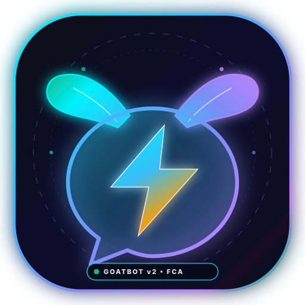

<div align="center">



<br><br>



# @floppa/fca-native

**Next-Generation Native Facebook Chat API Engine for GoatBot v2 & Floppa-Chatbot**  
*24/7 Session Stability • Adaptive Rate Limiter • Circuit Breaker Self-Healing • MQTT Realtime*

[](https://www.npmjs.com/package/@floppa/fca-native)
[](LICENSE)
[](https://nodejs.org/)
[](https://github.com/frnAlt/fca-native)
[-ec4899?style=for-the-badge)](https://github.com/frnAlt)

</div>

Native **Floppa-Chatbot Facebook Chat API Engine** — High-performance, modern 24/7 Messenger API designed as a drop-in replacement for all **GoatBot v2**, **Mirai**, and modern bot frameworks with advanced session stability, adaptive rate limiting, circuit breakers, and self-healing resilience.

It communicates via the same HTTP/GraphQL and MQTT protocols as the official browser client, providing programmatic access to messages, threads, reactions, typing indicators, attachments, and more — with full CommonJS and ES Module support and complete TypeScript typings.

> **Disclaimer:** This library operates by emulating a logged-in browser session. Using it may violate Facebook / Meta's Terms of Service and could result in account restrictions or bans. The authors assume **no responsibility** for how you use this software. Use it only for lawful purposes and at your own risk.

---

## 📑 Table of Contents

- [🌟 Native Architecture & Core Logic](#-native-architecture--core-logic)
- [🐐 GoatBot v2 & Metachat Compatibility](#-goatbot-v2--metachat-compatibility)
- [📦 Installation](#-installation)
- [🚀 Quick Start](#-quick-start)
- [🔑 Authentication & Cookie Formats](#-authentication--cookie-formats)
- [🧩 API Styles](#-api-styles)
- [🤖 MessengerBot (Event-Driven)](#-messengerbot-event-driven)
- [🛠️ Configuration (`fca-config.json`)](#️-configuration-fca-configjson)
- [📚 Core API Methods](#-core-api-methods)
- [👥 Authors & Credits](#-authors--credits)
- [📄 License](#-license)

---

## 🌟 Native Architecture & Core Logic

`@floppa/fca-native` includes an integrated suite of stability, security, and resilience subsystems designed to keep bots running continuously 24/7 without session degradation or account locks:

### 1. Enhanced Session Stability Manager (`SessionStabilityManager`)
- **Proactive Token & Session Refresh**: Automatically refreshes session tokens and `fb_dtsg` tokens before expiration.
- **Continuous Session Validation**: Performs background health checks and validates session integrity.
- **Resource & Memory Safeguards**: Tracks heap memory usage and resets stale connections to prevent memory leaks during long-running bot instances.

### 2. Intelligent Adaptive Rate Limiter (`AdaptiveRateLimiter`)
- **Multi-Bucket Throttling**: Independent sliding-window rate limit buckets for:
  - `message`: 60 operations/min
  - `thread`: 30 operations/min
  - `user`: 40 operations/min
  - `media`: 20 uploads/min
  - `typing`: 100 indicators/min
  - `global`: 150 total operations/min
- **Dynamic Penalty Scaling**: Analyzes Facebook HTTP response codes and headers; dynamically scales back request velocity when Facebook flags temporary rate limits.

### 3. Self-Healing & Fault Tolerance (`ResilienceManager`)
- **Circuit Breakers**: Implements 3-state circuit breakers (`CLOSED`, `OPEN`, `HALF_OPEN`) per endpoint to fail fast and prevent cascading network timeouts.
- **Bulkhead Concurrency Pools**: Limits concurrent network requests to prevent socket exhaustion.
- **Exponential Backoff & Jitter**: Automatically retries failed requests with randomized exponential backoff.

### 4. Real-Time Bot Health Monitor (`BotHealthMonitor`)
- **Live Health Score (0–100)**: Evaluates latency, error frequency, MQTT stability, and process memory.
- **Telemetry & Metrics**: Records API latency distributions, MQTT reconnect counts, and error classifications.
- **Proactive Recovery**: Automatically initiates self-healing or alert hooks when the health score falls below safety thresholds.

### 5. Multi-Format Cookie Parsing & Auth Core
- **Universal Cookie Normalizer**: Seamlessly parses and accepts:
  - **JSON AppState Array**: Standard array of cookie objects (`c_user`, `xs`, `datr`, etc.)
  - **Netscape Cookie Format**: Tab-separated format exported by browser tools
  - **Semicolon-Delimited String**: Raw HTTP `Cookie` header string
- **Built-in 2FA (TOTP)**: Integrated TOTP generator support for automated 2FA challenge resolution.

### 6. Lifecycle & Connection Management
- **`LifecycleManager`**: Traps OS signals (`SIGINT`, `SIGTERM`), ensures state serialization, closes active MQTT sessions, and shuts down gracefully.
- **`ConnectionPoolManager`**: High-performance HTTP Keep-Alive pooling and socket reuse across all Facebook endpoints.

---

## 🐐 GoatBot v2 & Metachat Compatibility

`@floppa/fca-native` is 100% compatible with the **GoatBot v2** ecosystem (as well as Mirai and Metachat consumers).

### Method 1: Drop-in Configuration
In your bot's `config.json` (or `fca-config.json`):
```json
{
  "optionsFca": {
    "fca": "@floppa/fca-native"
  }
}
```

### Method 2: GoatBot Login Loader (`bot/login/login.js`)
```javascript
const login = require("@floppa/fca-native");

login({ appState }, global.GoatBot.config.optionsFca, async (error, api) => {
  if (error) return console.error("Login failed:", error);
  global.GoatBot.fcaApi = api;
  // Proceeds with GoatBot v2 initialization
});
```

### Method 3: Local Engine Replacement (`./fca`)
Clone or copy `@floppa/fca-native` directly into the `./fca` directory in your bot's workspace. GoatBot will automatically detect and load it as a native local engine.

---

## 📦 Installation & Usage Guide

`@floppa/fca-native` is designed to be completely flexible. You can use it via **npm registry**, directly from **GitHub (like npm)**, or **completely without npm** as a local drop-in folder.

### 1. Install via npm / yarn / pnpm

```bash
# Standard npm install
npm install @floppa/fca-native@latest

# Yarn
yarn add @floppa/fca-native

# pnpm
pnpm add @floppa/fca-native
```

---

### 2. Install Directly from GitHub (Like npm, No Registry Required)

You can install `@floppa/fca-native` directly from GitHub into any bot project without relying on npm releases:

```bash
# Install directly from GitHub shortcut
npm install github:frnAlt/fca-native

# Or via full Git URL
npm install https://github.com/frnAlt/fca-native.git

# Or via SSH
npm install git+ssh://git@github.com:frnAlt/fca-native.git
```

#### In your bot's `package.json`:
You can declare it directly as a GitHub dependency:
```json
{
  "dependencies": {
    "@floppa/fca-native": "github:frnAlt/fca-native"
  }
}
```
Then simply run `npm install`. Node will automatically resolve and require it just like an npm package:
```javascript
const login = require("@floppa/fca-native");
```

---

### 3. Use Without npm (Local Clone / Standalone Drop-in `./fca`)

If you don't want to publish/install via npm or want an offline-ready, portable local engine:

#### Step 1: Clone into your bot directory
Clone directly into the `./fca` folder inside your bot project root:
```bash
# In your bot root directory:
git clone https://github.com/frnAlt/fca-native.git ./fca
```

#### Step 2: Install internal dependencies
```bash
cd fca
npm install --production
cd ..
```

#### Step 3: Require directly in your code
You can now import the engine directly without any package resolution:
```javascript
// Load from local folder
const login = require("./fca");

login({ appState: require("./appstate.json") }, (err, api) => {
  if (err) return console.error("Login failed:", err);
  console.log("Logged in using local native engine!");
});
```

> **🐐 GoatBot v2 Automatic Detection:**  
> GoatBot v2's `login.js` natively checks for `./fca` first:
> ```javascript
> const localFca = defaultRequire(path.join(process.cwd(), "fca"));
> ```
> If `./fca` exists, GoatBot **automatically detects and loads it** as the native local engine with zero extra configuration required!

---

### Build Artifacts Provided

| File | Format / Role |
|---|---|
| `index.js` | **Universal CommonJS Entry** — Callable default `login` export for GoatBot & Node.js |
| `dist/cjs.cjs` | CommonJS legacy entry for Mirai / older bundlers |
| `dist/index.mjs` | ES Modules (ESM) bundle |
| `src/types/index.d.ts` | Complete TypeScript type definitions |

---

## 🚀 Quick Start

### 1. Classic `require` (Default Export = `login`)

Compatible with standard FCA bot scripts and GoatBot. The required module **is** `login`:

```javascript
const login = require("@floppa/fca-native");

login({ appState: require("./appstate.json") }, (err, api) => {
  if (err) return console.error("Login failed:", err);

  api.setOptions({ listenEvents: true, selfListen: false });

  api.listenMqtt((err, event) => {
    if (err) return console.error("MQTT Error:", err);
    if (event.type === "message") {
      api.sendMessage("Hello from Floppa FCA Native! 🚀", event.threadID);
    }
  });
});
```

### 2. Modern Async / Await Style

```javascript
const { login } = require("@floppa/fca-native");

async function main() {
  const api = await login({
    appState: require("./appstate.json")
  }, {
    listenEvents: true,
    autoReconnect: true
  });

  console.log(`Logged in as User ID: ${api.getCurrentUserID()}`);

  api.listenMqtt(async (err, event) => {
    if (err) return console.error(err);
    if (event.type === "message") {
      await api.sendMessage(`Echo: ${event.body}`, event.threadID);
    }
  });
}

main();
```

### 3. Event-Driven Bot Engine (`createMessengerBot`)

```javascript
const { createMessengerBot } = require("@floppa/fca-native");

async function main() {
  const bot = await createMessengerBot(
    { appState: require("./appstate.json") },
    {
      listenEvents: true,
      stopOnSignals: true,
      commandPrefix: "/"
    }
  );

  bot.on("error", (err) => console.error("Bot error:", err));

  bot.on("messageCreate", (event) => {
    if (event.body) {
      console.log(`[${event.threadID}] ${event.body}`);
    }
  });

  bot.command("ping", async (ctx) => {
    await ctx.replyAsync("pong! 🏓");
  });
}

main();
```

---

## 🔑 Authentication & Cookie Formats

`@floppa/fca-native` supports multiple flexible credential strategies:

| Credential | Description |
|---|---|
| `appState` | JSON array of cookie objects (`[ { key, value, domain, path, ... } ]`). **Recommended for 24/7 bots.** |
| `Cookie` | Raw semicolon-delimited cookie string, e.g. `"c_user=...; xs=...; datr=...;"`. |
| `email` + `password` | Web credentials (optionally with 2FA secret key via `twofactor`). |

The auth core automatically normalizes Netscape cookie formats, raw strings, and handles session persistence seamlessly.

---

## 🧩 API Styles

### 1. Flat API (Classic Compatibility)

Every method is directly available on `api`:

```javascript
api.sendMessage("Hello!", threadID);
api.getThreadInfo(threadID, (err, info) => { ... });
api.setMessageReaction("❤️", messageID);
```

### 2. Namespaced Domain Client Facade

Organized by domain for modern TypeScript / ES codebases:

```typescript
import { createFcaClient } from "@floppa/fca-native";

const client = createFcaClient(ctx.api);

await client.messages.send("Hello!", threadID);
await client.threads.getInfo(threadID);
await client.users.getInfo(userID);
```

Available namespaces:
- `client.messages`
- `client.threads`
- `client.users`
- `client.account`
- `client.realtime`
- `client.http`
- `client.scheduler`

---

## 🤖 MessengerBot (Event-Driven)

`MessengerBot` provides a composable, event-driven framework:

```typescript
import { createMessengerBot } from "@floppa/fca-native";

const bot = await createMessengerBot(
  { appState: require("./appstate.json") },
  {
    listenEvents: true,
    stopOnSignals: true,
    commandPrefix: "/",
    maxEventListeners: 64,
    enableComposer: true
  }
);

// Global logging middleware
bot.use(async (ctx, next) => {
  console.log(`[Thread ${ctx.threadID}] ${ctx.text}`);
  await next();
});

// Command handler
bot.command("ping", async (ctx) => {
  await ctx.replyAsync("pong");
});

// Pattern matching
bot.hears(/hello/i, async (ctx) => {
  await ctx.replyAsync("Hi there!");
});
```

### Events

| Event | Trigger |
|---|---|
| `message` / `messageCreate` | Any incoming message (including replies) |
| `message_reply` | A reply to an existing message |
| `messageReactionAdd` | Reaction added to a message |
| `messageDelete` | Message unsent / deleted |
| `typingStart` / `typingStop` | Typing indicators |
| `threadUpdate` | Thread title, emoji, or participant updates |
| `ready` | MQTT session established |
| `error` | Any error during listening |

---

## 🛠️ Configuration (`fca-config.json`)

When loaded, `@floppa/fca-native` will search for `fca-config.json` in the current working directory, generating safe defaults if absent:

```json
{
  "checkUpdate": {
    "enabled": true,
    "packageName": "@floppa/fca-native",
    "registryUrl": "https://registry.npmjs.org",
    "notifyIfCurrent": false
  },
  "mqtt": {
    "enabled": true,
    "reconnectInterval": 3600
  },
  "autoLogin": true,
  "antiSuspension": {
    "enabled": true,
    "warmupOnStart": true
  },
  "healthMonitor": {
    "enabled": true,
    "logIntervalMs": 3600000
  },
  "threadCache": {
    "maxAgeMs": 900000,
    "invalidateIntervalMs": 900000
  }
}
```

---

## 📚 Core API Methods

| Method | Description |
|---|---|
| `api.sendMessage(msg, threadID, [callback], [replyToID])` | Send text, attachments, mentions, or replies |
| `api.listenMqtt(callback)` | Start real-time MQTT listener for messages & events |
| `api.stopListening([callback])` | Gracefully disconnect MQTT listener |
| `api.getThreadInfo(threadID, [callback])` | Retrieve full group or DM thread metadata |
| `api.getUserInfo(userID(s), [callback])` | Fetch user profile information and avatars |
| `api.sendTypingIndicator(state, threadID)` | Show or hide typing bubble (`true`/`false`) |
| `api.setMessageReaction(reaction, messageID)` | React to a message with emojis (`👍`, `❤️`, etc.) |
| `api.changeNickname(nickname, threadID, userID)` | Change a member's nickname in a chat |
| `api.changeThreadColor(color, threadID)` | Set group chat theme color |
| `api.changeThreadEmoji(emoji, threadID)` | Update group chat default emoji |
| `api.changeGroupImage(stream, threadID)` | Change group chat avatar photo |
| `api.unsendMessage(messageID, [callback])` | Unsend (delete for everyone) a sent message |
| `api.deleteMessage(messageIDs, [callback])` | Delete message(s) from current view |
| `api.addUserToGroup(userID, threadID)` | Add a member to a group chat |
| `api.removeUserFromGroup(userID, threadID)`| Remove/kick a member from a group chat |
| `api.createPoll(title, options, threadID)` | Create a poll in a group chat |
| `api.getCurrentUserID()` | Get logged-in bot account's UID |
| `api.getAppState()` | Export current active session cookie array |
| `api.logout([callback])` | Safely logout active session |

---

## 👥 Authors & Credits

- **Author & Lead Developer:** [Gtajisan (Farhan Muh Tasim / frnAlt)](https://github.com/frnAlt)
- **Core Architecture & Resilience:** [NeoKEX (lazyneoaz)](https://github.com/lazyneoaz) — Creator of [Metachat](https://github.com/lazyneoaz/Metachat)
- **Foundational Contributions:** [DongDev](https://github.com/dongp06)
- **Community:** [GoatBot v2](https://github.com/frnAlt/Floppa-Chatbot) & Facebook Chat API open-source contributors

---

## 📄 License

This project is licensed under the [Apache License, Version 2.0](./LICENSE).

<div align="center">
  <sub>Built with ❤️ by frnAlt & lazyneoaz for the GoatBot and Messenger bot community.</sub>
</div>
