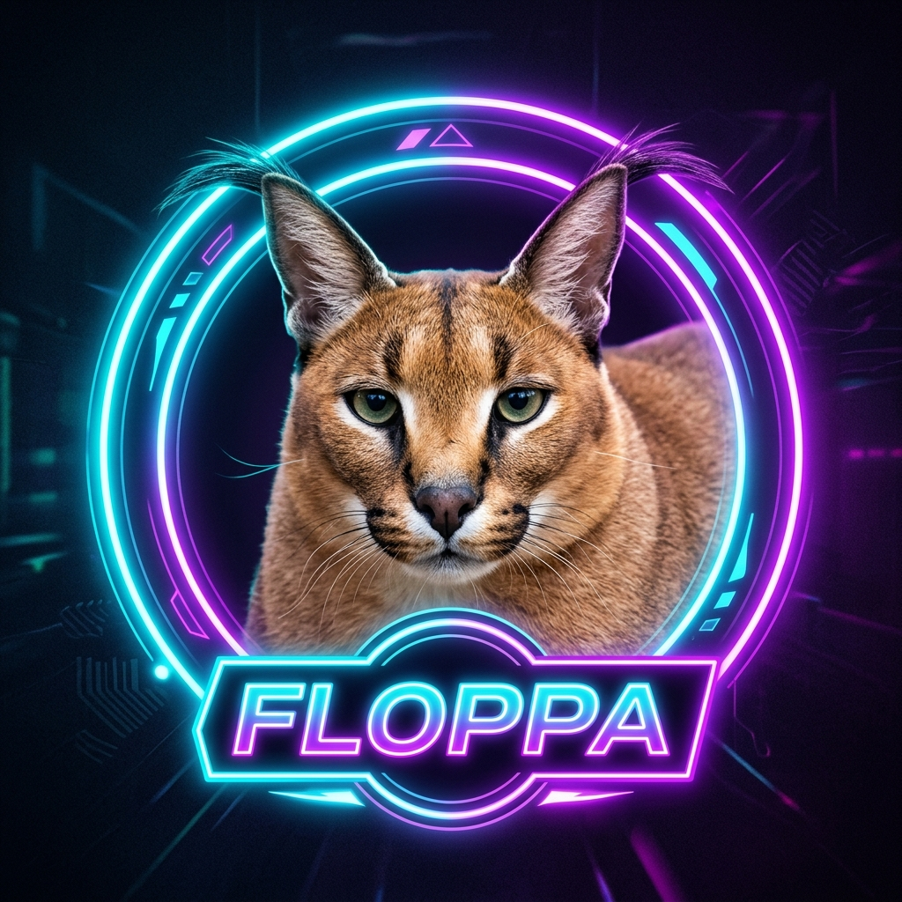

<div align="center">
  

  <br><br>

  

  <h1>@floppa/fca-native</h1>

  <p><strong>Next-Generation Native Facebook Chat API Engine for GoatBot v2 &amp; Modern Messenger Automation</strong></p>

  <p>
    <a href="https://www.npmjs.com/package/@floppa/fca-native"></a>
    <a href="https://github.com/frnAlt/fca-native"></a>
    <a href="https://nodejs.org"></a>
    <a href="https://github.com/frnAlt/fca-native"></a>
    <a href="https://github.com/frnAlt/fca-native/issues"></a>
  </p>
</div>

---

## 🌟 Overview

**`@floppa/fca-native`** is an enterprise-grade, high-performance Facebook Chat API engine built from the ground up for **GoatBot v2**, **Mirai**, and modern Facebook Messenger bot architectures.

Emulating official web browser & MQTT protocols, `@floppa/fca-native` delivers maximum uptime, robust anti-suspension protections, automated session healing, and zero-configuration drop-in compatibility for bot frameworks.

---

## ⚡ Key Features

- 🎯 **GoatBot v2 Native**: Fully compatible drop-in replacement for all GoatBot v2 and Mirai-based bots.
- 📡 **Real-Time MQTT 5 Protocol**: Blazing fast event delivery, typing indicators, read receipts, and live delta events.
- 🛡️ **Anti-Suspension Circuit Breaker**: Dynamic throttling, intelligent cooldowns, and real-time account health monitoring to minimize checkpoints.
- 🔄 **Self-Healing Session Recovery**: Multi-endpoint cookie synchronization, token auto-refresh, and automatic reconnection on drops.
- 🧩 **Multi-Paradigm API**: Use classic callback style (`login(creds, callback)`), modern `async/await` (`const api = await login(creds)`), or event-driven bots (`createMessengerBot`).
- 📁 **Universal Cookie Support**: Accepts JSON appstate, Netscape format, or raw cookie strings (`c_user=...; xs=...`).
- 🚀 **Full Messenger Feature Set**: Text, attachments, replies, mentions, reactions, polls, thread settings, bio/avatar updates, stories, and contact cards.

---

## 📦 Installation

```bash
# npm
npm install @floppa/fca-native

# yarn
yarn add @floppa/fca-native

# pnpm
pnpm add @floppa/fca-native
```

---

## 🐐 Using with GoatBot v2

### Option 1: Configure as Primary FCA Package

Install `@floppa/fca-native` in your GoatBot v2 root directory:

```bash
npm install @floppa/fca-native
```

In your GoatBot `config.json` (or `fca-config.json`):

```json
{
  "fca": "@floppa/fca-native"
}
```

### Option 2: Use in GoatBot's `login.js`

```javascript
// bot/login/login.js
const login = require("@floppa/fca-native");

login({ appState }, global.GoatBot.config.optionsFca, async (error, api) => {
  if (error) return console.error("Login failed:", error);
  global.GoatBot.fcaApi = api;
  // Bot initialization continues...
});
```

### Option 3: Local Engine Replacement

You can clone or copy `@floppa/fca-native` directly into the `./fca` directory inside your bot root. GoatBot will automatically detect and load it as a native local engine.

---

## 🚀 Quick Start (Standalone)

### 1. Classic Callback Style (Mirai / GoatBot)

```javascript
const login = require("@floppa/fca-native");

login({ appState: require("./appstate.json") }, { listenEvents: true }, (err, api) => {
  if (err) return console.error(err);

  api.setOptions({ listenEvents: true, selfListen: false });

  api.listenMqtt((error, event) => {
    if (error) return console.error("Listen error:", error);

    if (event.type === "message") {
      if (event.body === "/ping") {
        api.sendMessage("Pong! 🏓", event.threadID, event.messageID);
      }
    }
  });
});
```

### 2. Modern Async / Await Style

```javascript
const { login } = require("@floppa/fca-native");

async function start() {
  const api = await login({
    appState: require("./appstate.json")
  }, {
    listenEvents: true,
    autoReconnect: true
  });

  console.log(`Logged in as User ID: ${api.getCurrentUserID()}`);

  api.listenMqtt(async (error, event) => {
    if (error) return console.error(error);
    if (event?.type !== "message") return;

    if (event.body?.toLowerCase() === "hi") {
      await api.sendMessage(`Hello! Echo: ${event.body}`, event.threadID);
    }
  });
}

start();
```

### 3. Event-Driven Bot Engine (`createMessengerBot`)

```javascript
const { createMessengerBot } = require("@floppa/fca-native");

async function main() {
  const bot = await createMessengerBot(
    { appState: require("./appstate.json") },
    {
      commandPrefix: "/",
      listenEvents: true,
      stopOnSignals: true
    }
  );

  bot.on("messageCreate", (event) => {
    console.log(`[${event.threadID}] ${event.body}`);
  });

  bot.command("ping", async (ctx) => {
    await ctx.replyAsync("Pong! 🏓");
  });

  bot.command("echo", async (ctx) => {
    await ctx.replyAsync(ctx.args.join(" ") || "Nothing to echo!");
  });
}

main();
```

---

## 🛠️ Configuration (`fca-config.json`)

You can place an optional `fca-config.json` file in your bot root directory to customize engine behaviors:

```json
{
  "checkUpdate": {
    "enabled": true,
    "packageName": "@floppa/fca-native",
    "registryUrl": "https://registry.npmjs.org",
    "notifyIfCurrent": false
  },
  "mqtt": {
    "enabled": true,
    "reconnectInterval": 3600
  },
  "autoLogin": true,
  "antiSuspension": {
    "enabled": true,
    "warmupOnStart": true
  },
  "healthMonitor": {
    "enabled": true,
    "logIntervalMs": 3600000
  },
  "threadCache": {
    "maxAgeMs": 900000,
    "invalidateIntervalMs": 900000
  }
}
```

---

## 📚 Core API Methods

| Method | Description |
|---|---|
| `api.sendMessage(msg, threadID, [callback], [replyToID])` | Send a message (text, attachments, mentions) |
| `api.listenMqtt(callback)` | Start real-time MQTT listener for messages & events |
| `api.stopListening([callback])` | Gracefully disconnect MQTT listener |
| `api.getThreadInfo(threadID, [callback])` | Retrieve full group or DM thread metadata |
| `api.getUserInfo(userID(s), [callback])` | Fetch user profile information and avatars |
| `api.sendTypingIndicator(state, threadID)` | Show or hide typing bubble (`true`/`false`) |
| `api.setMessageReaction(reaction, messageID)` | React to a message with emojis (`👍`, `❤️`, etc.) |
| `api.changeNickname(nickname, threadID, userID)` | Change a member's nickname in a chat |
| `api.changeThreadColor(color, threadID)` | Set group chat theme color |
| `api.changeThreadEmoji(emoji, threadID)` | Update group chat default emoji |
| `api.changeGroupImage(stream, threadID)` | Change group chat avatar photo |
| `api.unsendMessage(messageID, [callback])` | Unsend (delete for everyone) a sent message |
| `api.deleteMessage(messageIDs, [callback])` | Delete message(s) from current view |
| `api.addUserToGroup(userID, threadID)` | Add a member to a group chat |
| `api.removeUserFromGroup(userID, threadID)`| Remove/kick a member from a group chat |
| `api.createPoll(title, options, threadID)` | Create a poll in a group chat |
| `api.getCurrentUserID()` | Get logged-in bot account's UID |
| `api.getAppState()` | Export current active session cookie array |
| `api.logout([callback])` | Safely logout active session |

---

## 🔒 Security Best Practices

- ⚠️ **Never commit session cookies**: Keep `appstate.json` or cookies out of public repositories. Add them to `.gitignore`.
- 🛡️ **Anti-Ban Precautions**: Avoid excessive spamming. Utilize `@floppa/fca-native`'s built-in anti-suspension rate limiter.
- 🔑 **Rotate Sessions**: If an account is challenged with a checkpoint, regenerate fresh cookies rather than retrying in an infinite loop.

---

## 👥 Developers & Credits

- **[Gtajisan (Farhan Muh Tasim / frnAlt)](https://github.com/frnAlt)** — Lead Developer & Maintainer of `@floppa/fca-native`.
- **[NeoKEX (lazyneoaz)](https://github.com/lazyneoaz)** — Core Architecture, Resilience Manager & Creator of [Metachat](https://github.com/lazyneoaz/Metachat).
- **[DongDev](https://github.com/dongp06)** — Foundational Contributions.
- **GoatBot & FCA Community** — Ongoing testing, feedback, and support.

---

## 📄 License

This project is licensed under the [Apache-2.0 License](./LICENSE).

<div align="center">
  <sub>Built with ❤️ for the GoatBot and Messenger automation community.</sub>
</div>
